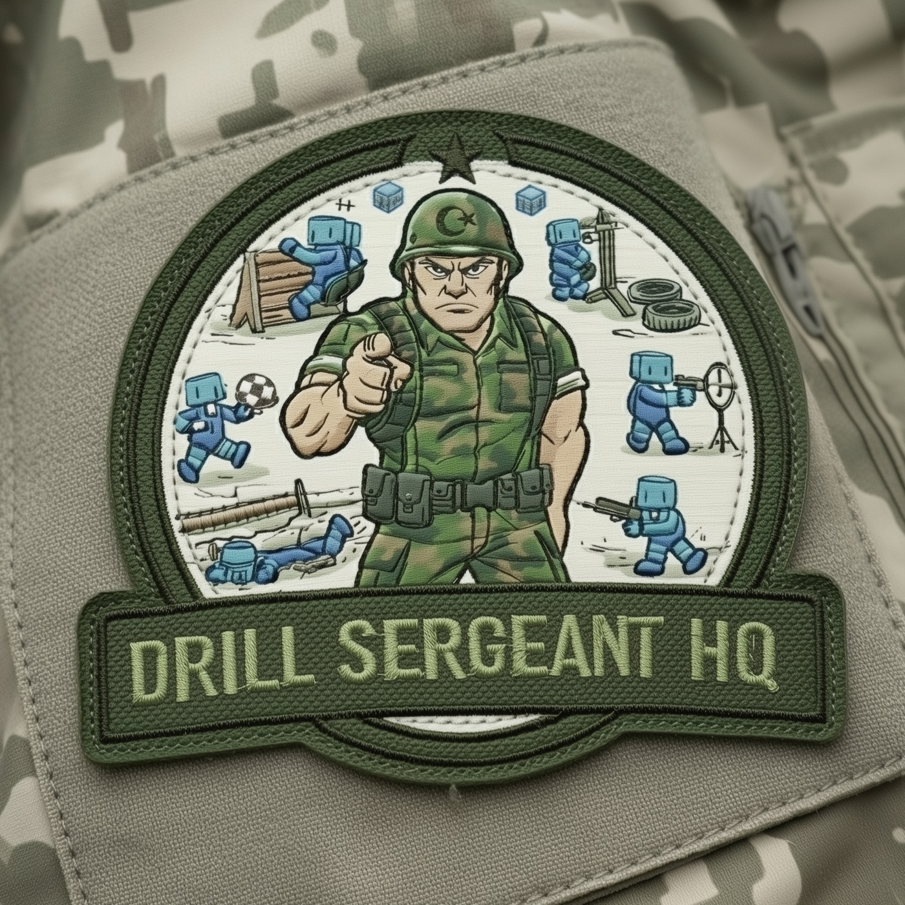

# DrillSergeantHQ

**Browser-only AI training playground** where you can *watch agents learn live* — built on **Rust → WASM**, **WebGPU (via `wgpu`)**, and **multi-threaded Workers**.

DrillSergeantHQ is built to capture a specific feeling: you can run a simple live match as a **demo/sandbox**, then hit **Train** and watch the agent’s behavior improve **while you’re watching**. You’ll have normal controls (Play/Pause, step speed, reset); the goal is to make learning feel **continuous and observable**, not hidden behind long offline runs.

## Why this exists

We’ve had enough of “just use a pre-trained model” and “just use a framework.” It’s useful—until it becomes a reflex. At some point, if you actually want to understand what’s going on, you have to go one layer down:

- write your own **simulation**
- write your own **inference**
- write your own **training loop**
- and watch the algorithm change behavior, step by step

DrillSergeantHQ is that learning project: **no magic boxes**, just the fundamentals—made exciting again by doing it in **Rust → WASM** with **WebGPU** and real-time visualization.

## What you can expect (v1 vision)

- **A live “show match”** (first environment: a simple 2D soccer-like arena).
- **Background training** constantly producing better policies.
- **Hot-swapped policies** so behavior can improve mid-session (optionally without restarting the on-screen simulation).
- **User interaction as evaluation** (initially not mixed into the training dataset).

## Tech focus (short)

- **Rust in the core**: deterministic simulation + RL/training logic compiled to **WASM**
- **WebGPU everywhere**: rendering + training compute via **`wgpu`**
- **Parallel by default**: multi-worker + WASM threads (requires SharedArrayBuffer / cross-origin isolation)

## Project principles

- **From-scratch core**: simulation, RL math, training loop, memory layouts, kernels—optimized specifically for this project.
- **Allowed deps are “protocol glue”**: WebGPU/WASM interop tooling is fine; full engines and full ML stacks are not the goal.
- **Performance matters**: fill CPU cores for rollouts, use GPU for rendering + training compute.

## Documentation

- **Technical design**: [`docs/technical-design.md`](docs/technical-design.md)

## Status

Early-stage design + planning. Implementation will land in small, performance-oriented pieces.

